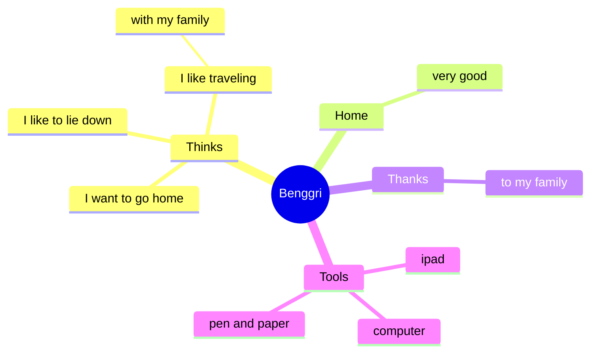

- 👋 Hi, I’m @benggri
- 👀 I’m Web Developer
  - Language & Framework
    - Java, Spring Framework, Spring Boot
    - javascript, Node.js, React, Angular
  - DB
    - RDB
      - ORACLE, TIBERO, MySQL, MariaDB, PostgreSQL
    - NoSQL
      - MongoDB, Redis
- 🌱 Recently, I am studying app development using Dart and Flutter
  - Android : https://play.google.com/store/apps/dev?id=9060554622254017436&hl=ko

---



---

[](https://github.com/anuraghazra/github-readme-stats)

---

```
🤍🤍🤍🤍🤍🤍🤍🤍🤍🤍🤍🤍🤍🤍🤍🤍🤍🤍🤍🤍🤍🤍🤍🤍🤍🤍🤍🤍🤍🤍🤍🤍🤍🤍🤍🤍🤍🤍🤍🤍🤍🤍🤍🤍🤍
🤍🤍💖💖💖💖💖💖🤍🤍💖💖🤍🤍🤍💖💖🤍🤍🤍💖💖🤍🤍💖💖💖💖🤍🤍🤍💖💖🤍🤍🤍🤍🤍🤍🤍🤍🤍💖💖🤍
🤍🤍🤍🤍💖💖🤍🤍🤍🤍💖💖🤍🤍🤍💖💖🤍🤍🤍💖💖🤍🤍🤍🤍🤍🤍🤍🤍🤍💖💖🤍🤍💖💖💖💖💖🤍🤍💖💖🤍
🤍🤍🤍🤍🧡🧡🤍🤍🤍🤍🧡🧡🤍🤍🤍🧡🧡🤍🤍🤍🧡🧡🤍🧡🧡🧡🧡🧡🧡🤍🤍🧡🧡🤍🤍🤍🤍🤍🧡🧡🤍🤍🧡🧡🤍
🤍🤍🤍🧡🧡🧡🧡🤍🧡🧡🧡🧡🤍🤍🤍🧡🧡🤍🤍🤍🧡🧡🤍🤍🤍🤍🤍🧡🧡🤍🤍🧡🧡🤍🤍🤍🤍🤍🧡🧡🧡🧡🧡🧡🤍
🤍🤍💛💛🤍💛💛🤍💛💛💛💛🤍🤍💛💛💛💛🤍🤍💛💛🤍🤍🤍🤍💛💛🤍🤍🤍💛💛🤍🤍🤍🤍🤍💛💛💛💛💛💛🤍
🤍💛💛🤍🤍🤍💛💛🤍🤍💛💛🤍💛💛🤍🤍💛💛🤍💛💛🤍🤍🤍💛💛💛🤍🤍🤍💛💛💛💛💛💛💛💛💛🤍🤍💛💛🤍
🤍🤍🤍🤍🤍🤍🤍🤍🤍🤍💚💚💚💚🤍🤍🤍🤍💚💚💚💚🤍🤍💚💚💚💚💚🤍🤍💚💚💚💚💚💚🤍🤍🤍🤍🤍💚💚🤍
🤍🤍🤍🤍💚💚💚💚💚💚🤍🤍🤍🤍🤍🤍🤍🤍🤍🤍💚💚🤍💚💚🤍🤍🤍💚💚🤍💚💚🤍🤍💚💚🤍🤍🤍💚💚💚💚🤍
🤍🤍🤍💙💙💙💙💙💙💙💙🤍🤍🤍💙💙🤍🤍🤍🤍💙💙💙💙💙🤍🤍🤍💙💙💙💙💙🤍🤍💙💙🤍🤍🤍💙💙💙💙🤍
🤍🤍🤍💙💙🤍🤍🤍🤍💙💙🤍🤍🤍💙💙🤍🤍🤍🤍🤍🤍🤍🤍🤍🤍🤍🤍🤍🤍🤍💙💙🤍🤍💙💙🤍🤍🤍🤍🤍💙💙🤍
🤍🤍🤍💜💜💜💜💜💜💜💜🤍🤍🤍💜💜🤍🤍🤍🤍🤍🤍🤍🤍🤍🤍🤍🤍🤍🤍🤍💜💜🤍🤍💜💜💜💜💜🤍🤍💜💜🤍
🤍🤍🤍🤍💜💜💜💜💜💜🤍🤍🤍🤍💜💜💜💜💜💜💜💜🤍🤍🤍🤍🤍🤍🤍🤍🤍💜💜🤍🤍🤍🤍🤍🤍🤍🤍🤍💜💜🤍
🤍🤍🤍🤍🤍🤍🤍🤍🤍🤍🤍🤍🤍🤍🤍🤍🤍🤍🤍🤍🤍🤍🤍🤍🤍🤍🤍🤍🤍🤍🤍🤍🤍🤍🤍🤍🤍🤍🤍🤍🤍🤍🤍🤍🤍
```


